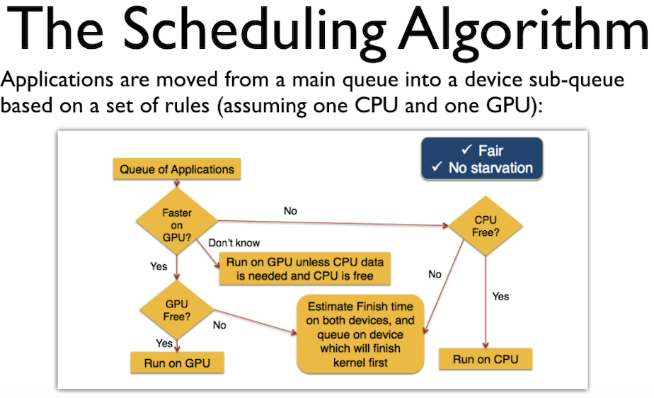

# Priority Queue Bottleneck
This Go project creates a scheduler. It uses a priority queue. Tasks go to a CPU or GPU. The choice depends on their intensity. Tasks with a stronger device preference get priority. Bottlenecks happen when resources are full. This disrupts the priority order. Tasks may get delayed or rerouted. The idea comes from Chris G.'s Ph.D. dissertation. The scheduler ensures fairness. It also prevents starvation. A flowchart shows the scheduling process.

## Installation

1. Clone the repository:
    ```sh
    git clone https://github.com/mdshahjahanmiah/priority-queue-bottleneck.git
    ```
2. Navigate to the project directory:
    ```sh
    cd priority-queue-bottleneck
    ```
3. Install dependencies:
    ```sh
    go mod tidy
    ```

## Usage

1. Run the scheduler:
    ```sh
    go run main.go
    ```
   This will create and schedule 50 tasks, process them, and print the final metrics in a table format.

2. Run the tests to verify the scheduler functionality:
    ```sh
    go test -v ./scheduler
    ```
## Scheduling Algorithm
The scheduler uses the following algorithm to route tasks:
1. **Priority Queue**: Tasks are initially added to a priority queue, where they are prioritized based on the absolute difference between their `CPUIntensity` and `GPUIntensity` (`|GPUIntensity - CPUIntensity|`). A larger difference indicates a stronger preference for one device, giving the task higher priority.
2. **Routing Rules**:
   - **Faster on GPU?** If `GPUIntensity > CPUIntensity`, try to schedule on the GPU.
   - **GPU Free?** If the GPU queue has space, send the task to the GPU. Otherwise, check the CPU.
   - **CPU Free?** If the CPU queue has space, send the task to the CPU. Otherwise, re-add the task to the priority queue.
   - The same logic applies in reverse for CPU-bound tasks.
3. **Workers**: Each queue (CPU and GPU) has a set of workers that process tasks by simulating work with a sleep duration proportional to the task’s intensity.

## Priority Queue and Bottlenecks
The priority queue ensures that tasks with a stronger device preference are scheduled first. However, during bottlenecks—when both the CPU and GPU queues are full—the priority queue’s ordering can break down:
- Tasks that cannot be scheduled are re-added to the priority queue.
- Lower-priority tasks already in the CPU/GPU queues may be processed before higher-priority tasks that are stuck waiting in the priority queue.
- Tasks may be routed to a suboptimal device (e.g., a GPU-intensive task running on the CPU) if their preferred queue is full.

## Results
The following table shows the results of scheduling 50 tasks with a queue size of 10 and 3 workers per queue (CPU and GPU). The tasks were generated with random `CPUIntensity` and `GPUIntensity` values between 0 and 10.

| TASK ID | TASK NAME | CPU INTENSITY | GPU INTENSITY | DESTINATION     |
|---------|-----------|---------------|---------------|-----------------|
| 40      | Task-40   | 0.87          | 6.41          | GPU             |
| 41      | Task-41   | 3.62          | 4.90          | GPU             |
| 43      | Task-43   | 5.27          | 7.71          | GPU             |
| 44      | Task-44   | 5.20          | 0.08          | CPU             |
| 42      | Task-42   | 6.62          | 4.62          | GPU (CPU full)  |
| 45      | Task-45   | 1.49          | 3.39          | CPU (GPU full)  |
| 46      | Task-46   | 6.66          | 9.86          | CPU (GPU full)  |
| 50      | Task-50   | 6.31          | 1.58          | GPU (CPU full)  |
| 48      | Task-48   | 3.82          | 4.75          | CPU (GPU full)  |
| 47      | Task-47   | 8.70          | 9.59          | GPU             |
| 49      | Task-49   | 5.08          | 5.89          | CPU (GPU full)  |

### Observations
- **Priority Queue Behavior**: The priority queue prioritizes tasks based on the intensity difference (`|GPUIntensity - CPUIntensity|`). For example, Task-9 (intensity difference = 6.04) and Task-34 (intensity difference = 9.09) have large differences and were scheduled early, as expected.
- **Bottleneck Effects**:
   - Several tasks were routed to suboptimal devices due to queue bottlenecks:
      - Task-39 (`CPUIntensity: 7.03`, `GPUIntensity: 5.89`) was CPU-bound but ran on the GPU because the CPU queue was full.
      - Task-46 (`CPUIntensity: 6.66`, `GPUIntensity: 9.86`) was GPU-bound but ran on the CPU because the GPU queue was full.
   - This demonstrates the "priority queue losing priority" concept: during bottlenecks, high-priority tasks may be delayed or misrouted, while lower-priority tasks already in the CPU/GPU queues are processed first.
- **Task Distribution**:
   - Out of 49 tasks scheduled (Task-47 is the last in the table, suggesting some tasks may have been re-added to the priority queue and not processed within the 2-second window), 24 were scheduled on the CPU, and 25 on the GPU.
   - The presence of "CPU (GPU full)" and "GPU (CPU full)" destinations indicates frequent bottlenecks, especially for later tasks (e.g., Task-45 to Task-50).

## Dependencies

- [github.com/olekukonko/tablewriter](https://github.com/olekukonko/tablewriter): Used for printing task metrics in a table format.
## License

This project is licensed under the MIT License.